# TradeJournal Architecture - Visual Diagram

## Complete System Overview

```mermaid
flowchart TB
    subgraph Client["🌐 Client Layer"]
        Browser["Web Browser<br/>Chrome, Firefox, Safari"]
    end
    
    subgraph Frontend["⚛️ Frontend Application"]
        direction TB
        Router["React Router<br/>SPA Navigation"]
        
        subgraph Auth["🔐 Authentication"]
            AuthContext["Auth Context<br/>JWT Management"]
            Login["Login/Register Pages"]
        end
        
        subgraph Core["Core Pages"]
            Dashboard["📊 Dashboard<br/>Overview & Metrics"]
            Positions["📈 Positions<br/>Open Positions Table"]
            Trades["📋 Trades List<br/>Closed Positions"]
            Analytics["📉 Analytics<br/>Performance Charts"]
        end
        
        subgraph Support["Support Features"]
            Import["📥 Import Data<br/>CSV Upload"]
            Settings["⚙️ Settings<br/>User Preferences"]
            Admin["👨‍🏫 Admin<br/>Instructor Dashboard"]
        end
        
        subgraph Services["Frontend Services"]
            PosService["positionsService.ts<br/>Position CRUD & Analytics"]
            AuthService["authService.ts<br/>Authentication"]
            ImportService["importService.ts<br/>CSV Processing"]
        end
    end
    
    subgraph Backend["🐍 Backend API"]
        direction TB
        FastAPI["FastAPI Application<br/>Python Web Framework"]
        
        subgraph Routes["API Routes"]
            AuthAPI["🔑 /api/auth<br/>Login, Register, Token"]
            PosAPI["📦 /api/v2/positions<br/>CRUD Operations"]
            EventAPI["📝 /api/v2/positions/events<br/>Buy/Sell Events"]
            AnalyticsAPI["📊 /api/analytics<br/>Performance Stats"]
            AdminAPI["👨‍🏫 /api/admin<br/>Instructor Tools"]
        end
        
        subgraph BizLogic["Business Logic"]
            PosSvc["PositionService<br/>Core Logic"]
            
            subgraph EventSourcing["Event Sourcing"]
                CreateEvent["Create Events<br/>(Buy/Sell)"]
                FIFO["FIFO Calculator<br/>(Cost Basis)"]
                Recalc["Recalculate Position<br/>(Aggregate State)"]
            end
            
            ImportSvc["ImportService<br/>CSV Processing"]
            AnalyticsSvc["AnalyticsService<br/>Metrics Calculation"]
        end
        
        subgraph Models["Data Models"]
            Position["TradingPosition<br/>(Aggregated View)"]
            Event["TradingPositionEvent<br/>(Immutable History)"]
            User["User<br/>(Authentication)"]
        end
    end
    
    subgraph DataLayer["💾 Data Layer"]
        direction TB
        Postgres[("PostgreSQL<br/>Relational Database<br/>10+ Tables")]
        Redis[("Redis<br/>Cache & Sessions<br/>30s TTL")]
        Files[("Static Files<br/>Charts & Images<br/>S3/Local Storage")]
    end
    
    Browser --> Router
    Router --> Auth
    Router --> Core
    Router --> Support
    Core --> Services
    Support --> Services
    Auth --> Services
    
    Services -->|"HTTP/REST"| FastAPI
    FastAPI --> Routes
    Routes --> BizLogic
    BizLogic --> EventSourcing
    EventSourcing --> Models
    Models --> Postgres
    BizLogic --> Redis
    Routes --> Files
    
    style Client fill:#e8f5e9,stroke:#2e7d32,stroke-width:3px
    style Frontend fill:#e3f2fd,stroke:#1976d2,stroke-width:3px
    style Backend fill:#fff3e0,stroke:#f57c00,stroke-width:3px
    style DataLayer fill:#f3e5f5,stroke:#7b1fa2,stroke-width:3px
    style EventSourcing fill:#ffccbc,stroke:#d84315,stroke-width:2px
```

## Position Lifecycle - Event Sourcing Pattern

```mermaid
flowchart LR
    subgraph User["👤 User Actions"]
        direction TB
        Create["Create Position<br/>Initial Buy Event"]
        Add["Add Shares<br/>Buy Event"]
        Sell["Sell Shares<br/>Sell Event"]
        Update["Update Metadata<br/>Notes/Strategy"]
    end
    
    subgraph EventLog["📚 Event Log (Immutable)"]
        direction TB
        E1["Event 1: BUY<br/>100 @ $50.00<br/>2024-01-01"]
        E2["Event 2: BUY<br/>50 @ $52.00<br/>2024-01-15"]
        E3["Event 3: SELL<br/>75 @ $55.00<br/>2024-02-01"]
        E4["Event 4: SELL<br/>75 @ $48.00<br/>2024-02-15"]
    end
    
    subgraph Processing["⚙️ Event Processing"]
        direction TB
        FIFO["FIFO Cost Basis<br/>First In, First Out"]
        CalcShares["Calculate Shares<br/>Σ buys - Σ sells"]
        CalcPnL["Calculate P&L<br/>(sell price - cost) × shares"]
        CalcAvg["Calculate Avg Entry<br/>Total cost ÷ shares"]
    end
    
    subgraph Aggregate["📊 Aggregated Position"]
        direction TB
        Current["Current State<br/>━━━━━━━━━━<br/>Shares: 0<br/>Avg Entry: $50.67<br/>Total Cost: $0<br/>Realized P&L: -$225<br/>Status: CLOSED"]
    end
    
    Create --> E1
    Add --> E2
    Sell --> E3 & E4
    Update -.->|"Metadata Only"| Current
    
    E1 & E2 & E3 & E4 --> FIFO
    FIFO --> CalcShares & CalcPnL & CalcAvg
    CalcShares & CalcPnL & CalcAvg --> Current
    
    style User fill:#c8e6c9,stroke:#2e7d32
    style EventLog fill:#b3e5fc,stroke:#1976d2
    style Processing fill:#ffccbc,stroke:#d84315
    style Aggregate fill:#fff9c4,stroke:#f57c00
```

## Database Schema - Entity Relationships

## Request Flow - From Click to Database

```mermaid
sequenceDiagram
    participant U as 👤 User
    participant UI as 🎨 React UI
    participant S as 🔧 Service Layer
    participant API as 🌐 FastAPI
    participant Auth as 🔐 JWT Auth
    participant BL as 💼 Business Logic
    participant DB as 💾 PostgreSQL
    
    U->>UI: Click "Add to Position"
    UI->>UI: Open Modal
    U->>UI: Enter shares & price
    UI->>UI: Validate Input
    UI->>S: positionsService.addToPosition()
    S->>API: POST /api/v2/positions/{id}/events
    
    API->>Auth: Verify JWT Token
    Auth->>Auth: Extract user_id
    Auth-->>API: Current User
    
    API->>BL: position_service.add_shares()
    BL->>DB: Create TradingPositionEvent
    BL->>BL: Recalculate Position (FIFO)
    BL->>DB: Update TradingPosition
    DB-->>BL: Success
    BL-->>API: Event + Position
    API-->>S: 201 Created
    S->>S: Clear Cache
    S-->>UI: Update State
    UI->>UI: Close Modal
    UI->>UI: Refresh Position List
    UI-->>U: Show Success Message
```

## CSV Import Pipeline

## Analytics Calculation Flow

## Component Hierarchy

## Authentication & Authorization Flow

## Technology Stack

---

**Generated:** November 21, 2025  
**For:** TradeJournal Project Architecture Documentation
