# TradeJournal - Complete Code Map & Architecture Analysis

**Project:** SAR Trading Journal
**Status:** Production (Railway Deployment)

---

## Executive Summary

**TradeJournal** is a full-stack trading journal application for tracking stock and options positions with event-sourced architecture. The system uses a modern tech stack with FastAPI (Python) backend and React/TypeScript frontend, deployed on Railway with PostgreSQL.

### Key Metrics
- **Total Backend Files:** ~40+ Python files
- **Total Frontend Files:** ~60+ TypeScript/TSX files
- **Database Tables:** 10+ tables (position-based architecture)
- **API Endpoints:** 50+ REST endpoints
- **Deployment:** Railway (Production), Docker Compose (Local)

---

## System Architecture Overview


---

## Core Data Flow - Position Lifecycle


---

## Frontend Architecture Deep Dive

### Page Structure

```mermaid
flowchart TD
    App["App.tsx<br/>Main Router"]
    
    subgraph Auth["🔐 Authentication"]
        Login["Login Page"]
        Register["Register Page"]
        ForgotPW["Forgot Password"]
        ResetPW["Reset Password"]
    end
    
    subgraph Protected["🔒 Protected Routes"]
        DashLayout["Dashboard Layout<br/>(Sidebar + Nav)"]
        
        subgraph MainPages["Main Pages"]
            Dash["Dashboard<br/>Metrics & Overview"]
            Pos["Positions<br/>Open Positions Table"]
            TradesList["Trades List<br/>Closed Positions"]
            Anal["Analytics<br/>Performance Charts"]
            Imp["Import Data<br/>CSV Upload"]
            Set["Settings<br/>User Preferences"]
        end
        
        subgraph AdminPages["👨‍🏫 Admin Pages"]
            AdminDash["Admin Dashboard<br/>Student Overview"]
            StudentDetail["Student Detail<br/>Individual Analysis"]
        end
    end
    
    App --> Auth
    App --> Protected
    Protected --> DashLayout
    DashLayout --> MainPages
    DashLayout --> AdminPages
    
    style Auth fill:#ffcdd2
    style Protected fill:#c5e1a5
    style MainPages fill:#b3e5fc
    style AdminPages fill:#f8bbd0
```



### Component Hierarchy


---

## Backend Architecture Deep Dive

### API Route Structure


### Service Layer Architecture


---

## Database Schema


---

## Key Data Flows

### 1. CSV Import Flow


### 2. Dashboard Metrics Calculation


### 3. Authentication Flow


---

## Technology Stack Details

### Frontend Stack

| Layer | Technology | Purpose |
|-------|-----------|---------|
| **Framework** | React 18 | UI Library |
| **Language** | TypeScript | Type Safety |
| **UI Components** | Material-UI v5 | Component Library |
| **Routing** | React Router v6 | Navigation |
| **State Management** | React Context | Global State |
| **Forms** | React Hook Form | Form Handling |
| **Charts** | Recharts | Data Visualization |
| **HTTP Client** | Axios | API Communication |
| **Build Tool** | Vite | Fast Build & Dev Server |

### Backend Stack

| Layer | Technology | Purpose |
|-------|-----------|---------|
| **Framework** | FastAPI | Web Framework |
| **Language** | Python 3.11+ | Programming Language |
| **ORM** | SQLAlchemy | Database ORM |
| **Validation** | Pydantic | Data Validation |
| **Auth** | JWT (python-jose) | Authentication |
| **Password** | bcrypt | Password Hashing |
| **Database** | PostgreSQL | Production DB |
| **Cache** | Redis | Session & Cache |
| **File Upload** | FastAPI UploadFile | Image Handling |
| **CORS** | FastAPI CORS | Cross-Origin Support |

### Deployment Stack

| Component | Technology | Purpose |
|-----------|-----------|---------|
| **Hosting** | Railway | Cloud Platform |
| **Database** | Railway PostgreSQL | Managed DB |
| **Cache** | Railway Redis | Managed Cache |
| **Container** | Docker | Containerization |
| **CI/CD** | Railway Auto-Deploy | Automatic Deployment |
| **Static Files** | FastAPI Static | Asset Serving |

---

## File Organization

### Backend Structure

```
backend/
├── app/
│   ├── main.py                    # FastAPI application entry
│   ├── api/
│   │   ├── deps.py               # Dependency injection
│   │   └── routes/
│   │       ├── __init__.py       # Route aggregation
│   │       ├── auth.py           # Authentication endpoints
│   │       ├── users.py          # User management
│   │       ├── positions_v2.py   # Position CRUD (V2)
│   │       ├── analytics.py      # Analytics endpoints
│   │       ├── admin.py          # Admin/Instructor tools
│   │       ├── charts.py         # Chart management
│   │       └── position_images.py # Image upload
│   ├── core/
│   │   └── config.py             # Settings & configuration
│   ├── db/
│   │   └── session.py            # Database session
│   ├── models/
│   │   ├── __init__.py           # Model exports
│   │   ├── models.py             # Legacy models (deprecated)
│   │   ├── position_models.py    # Current models
│   │   └── schemas.py            # Pydantic schemas
│   ├── services/
│   │   ├── position_service.py   # Core position logic
│   │   ├── import_service.py     # CSV import
│   │   ├── analytics_service.py  # Analytics calculations
│   │   ├── email_service.py      # Email notifications
│   │   ├── chart_service.py      # Chart operations
│   │   └── user_service.py       # User operations
│   └── utils/
│       ├── datetime_utils.py     # Date/time helpers
│       └── options_parser.py     # Options symbol parsing
├── migrations/                    # Database migrations
├── static/                        # Static files (production)
├── requirements.txt              # Python dependencies
└── Dockerfile                    # Backend container
```

### Frontend Structure

```
frontend/
├── src/
│   ├── App.tsx                   # Main application
│   ├── main.tsx                  # Entry point
│   ├── components/
│   │   ├── CreatePositionModal.tsx
│   │   ├── AddToPositionModal.tsx
│   │   ├── SellFromPositionModal.tsx
│   │   ├── EditPositionModal.tsx
│   │   ├── PositionDetailsModal.tsx
│   │   ├── EditEventModal.tsx
│   │   ├── UpdateStopLossModal.tsx
│   │   ├── EventBreakdown.tsx
│   │   ├── JournalEntryList.tsx
│   │   ├── SmartJournal.tsx
│   │   ├── CurrencyDisplay.tsx
│   │   ├── CurrencyToggle.tsx
│   │   ├── ErrorBoundary.tsx
│   │   └── ProtectedRoute.tsx
│   ├── context/
│   │   ├── AuthContext.tsx       # Authentication state
│   │   └── CurrencyContext.tsx   # Currency preference
│   ├── hooks/
│   │   ├── useKeyboardShortcuts.ts
│   │   └── useCurrencyAwareFormatting.ts
│   ├── layouts/
│   │   └── DashboardLayout.tsx   # Main layout with sidebar
│   ├── pages/
│   │   ├── Dashboard.tsx         # Home dashboard
│   │   ├── Positions.tsx         # Open positions
│   │   ├── TradesList.tsx        # Closed positions
│   │   ├── Analytics.tsx         # Performance analytics
│   │   ├── ImportData.tsx        # CSV import
│   │   ├── Settings.tsx          # User settings
│   │   ├── Login.tsx             # Login page
│   │   ├── Register.tsx          # Registration
│   │   ├── AdminDashboard.tsx    # Instructor view
│   │   └── StudentDetailPage.tsx # Student analysis
│   ├── services/
│   │   ├── apiConfig.ts          # Axios configuration
│   │   ├── authService.ts        # Auth API calls
│   │   ├── positionsService.ts   # Position API calls
│   │   ├── importService.ts      # Import API calls
│   │   ├── journalService.ts     # Journal API calls
│   │   ├── userService.ts        # User API calls
│   │   └── accountService.ts     # Account API calls
│   ├── styles/                   # Global styles
│   └── utils/                    # Utility functions
├── public/                       # Static assets
├── package.json                  # Node dependencies
├── vite.config.ts               # Vite configuration
└── Dockerfile                    # Frontend container
```

---

## Current Issues & Technical Debt

### 1. **Inconsistent Model Usage**
- **Issue:** Mix of legacy (`models.py`) and new (`position_models.py`) models
- **Impact:** Confusion, potential bugs, increased maintenance
- **Solution:** Complete migration to position-based architecture, remove legacy code

### 2. **Incomplete Error Handling**
- **Issue:** Some API endpoints lack comprehensive error handling
- **Impact:** Poor user experience, debugging difficulties
- **Solution:** Standardize error responses, add try-catch blocks

### 3. **Missing TypeScript Types**
- **Issue:** Some frontend services use `any` type
- **Impact:** Loss of type safety benefits
- **Solution:** Define proper interfaces for all data structures

### 4. **Chart Formatting Issues**
- **Issue:** Charts don't display correctly in some contexts
- **Impact:** Poor UX, visual inconsistencies
- **Solution:** Review chart component props, fix responsive behavior

### 5. **Code Duplication**
- **Issue:** Similar logic repeated across services
- **Impact:** Maintenance overhead, inconsistency risk
- **Solution:** Extract common patterns into shared utilities

### 6. **Incomplete Admin System**
- **Issue:** Instructor features partially implemented
- **Impact:** Limited instructor functionality
- **Solution:** Complete instructor note system, add more admin tools

### 7. **Performance Bottlenecks**
- **Issue:** Dashboard loads all positions without pagination
- **Impact:** Slow load times with many positions
- **Solution:** Implement pagination, lazy loading, better caching

### 8. **Testing Coverage**
- **Issue:** Limited automated tests
- **Impact:** Risk of regressions, manual testing burden
- **Solution:** Add unit tests, integration tests, E2E tests

---

## Planned Improvements & Roadmap

### Phase 1: Code Quality & Cleanup (Priority: HIGH)


**Tasks:**
1. ✅ Deprecate `models.py` completely
2. ✅ Create error response standardization
3. ✅ Define TypeScript interfaces for all API responses
4. ✅ Fix chart responsive behavior
5. ✅ Extract common utilities to shared modules

### Phase 2: Feature Completion (Priority: MEDIUM)


**Tasks:**
1. 📋 Implement instructor notes visible to students (FEATURE_REQUESTS.md)
2. 📋 Add more analytics charts (drawdown, Sharpe ratio, etc.)
3. 📋 Support multiple broker import formats
4. 📋 Make UI fully responsive for mobile/tablet
5. 📋 Complete keyboard shortcut system

### Phase 3: Performance & Scalability (Priority: MEDIUM)


**Tasks:**
1. 📋 Add pagination to positions/trades lists
2. 📋 Optimize Redis caching strategy
3. 📋 Fix N+1 query issues (use joins)
4. 📋 Implement lazy loading for images
5. 📋 Move email sending to background tasks

### Phase 4: Testing & Quality Assurance (Priority: LOW)


**Tasks:**
1. 📋 Write unit tests for position_service.py
2. 📋 Add integration tests for API routes
3. 📋 Implement E2E tests with Playwright/Cypress
4. 📋 Run load tests with k6 or Locust
5. 📋 Conduct security audit

---

## Architecture Recommendations

### 1. **Adopt Clean Architecture Principles**


**Benefits:**
- Clear separation of concerns
- Easier testing (mock dependencies)
- Better maintainability
- Independent deployment of layers

### 2. **Implement Event Sourcing Pattern (Enhanced)**

Current implementation is good but could be improved:


**Improvements:**
- Add event replay capability
- Implement snapshots for performance
- Create materialized views for analytics

### 3. **Adopt Domain-Driven Design (DDD)**

Organize code by business domain:

```
backend/
├── domains/
│   ├── trading/
│   │   ├── positions/
│   │   │   ├── models.py
│   │   │   ├── services.py
│   │   │   ├── repository.py
│   │   │   └── schemas.py
│   │   ├── events/
│   │   └── analytics/
│   ├── users/
│   └── admin/
```

### 4. **Implement CQRS (Command Query Responsibility Segregation)**

Separate read and write operations:


**Benefits:**
- Optimized read/write performance
- Independent scaling
- Simplified query models

---

## Security Considerations

### Current Implementation


### Recommendations

1. **Add Rate Limiting**
   - Prevent brute force attacks
   - Protect against DoS

2. **Implement CSRF Protection**
   - Use CSRF tokens for state-changing operations
   - Validate Origin/Referer headers

3. **Add Input Validation**
   - Sanitize all user inputs
   - Validate file uploads

4. **Encrypt Sensitive Data**
   - Encrypt API keys at rest
   - Use HTTPS everywhere

5. **Implement Audit Logging**
   - Log all admin actions
   - Track position modifications

---

## Performance Optimization Plan

### Database Optimization


**Specific Tasks:**
1. Add indexes on frequently queried columns
2. Use SQLAlchemy `joinedload()` for relationships
3. Cache frequently accessed data in Redis
4. Create materialized views for analytics
5. Implement database connection pooling

### Frontend Optimization


**Specific Tasks:**
1. Implement route-based code splitting
2. Lazy load modals and heavy components
3. Use React.memo for expensive re-renders
4. Virtualize large tables (react-window)
5. Optimize image loading (lazy + compression)

---

## Deployment Architecture

### Current Railway Setup

```mermaid
flowchart TB
    subgraph Railway["Railway Platform"]
        direction TB
        
        subgraph Services["Services"]
            Web["Web Service<br/>(FastAPI + React)"]
            DB["PostgreSQL<br/>(Managed DB)"]
            Redis2["Redis<br/>(Managed Cache)"]
        end
        
        subgraph Deploy["Deployment"]
            Git["GitHub Push"]
            Build["Docker Build"]
            Deploy2["Auto Deploy"]
        end
    end
    
    Internet["Internet"]
    
    Internet --> Web
    Web --> DB
    Web --> Redis2
    
    Git --> Build
    Build --> Deploy2
    Deploy2 --> Web
    
    style Railway fill:#e8f5e9
    style Services fill:#c8e6c9
    style Deploy fill:#a5d6a7
```

### Recommended Multi-Environment Setup

```mermaid
flowchart TB
    subgraph Dev["Development"]
        DevLocal["Local Docker Compose"]
        DevDB["SQLite/PostgreSQL"]
    end
    
    subgraph Staging["Staging"]
        StageRailway["Railway Staging"]
        StageDB["PostgreSQL (small)"]
    end
    
    subgraph Prod["Production"]
        ProdRailway["Railway Production"]
        ProdDB["PostgreSQL (scaled)"]
        CDN["CDN for Assets"]
        Monitor["Monitoring<br/>(Sentry, Datadog)"]
    end
    
    Dev --> Staging
    Staging --> Prod
    
    style Dev fill:#fff9c4
    style Staging fill:#ffe0b2
    style Prod fill:#c8e6c9
```

---

## Conclusion

This TradeJournal project is a well-structured trading application with solid fundamentals. The event-sourced position architecture is a smart design choice that provides immutable audit trails and accurate P&L calculations.

### Strengths ✅
- Clean event-sourced architecture
- Modern tech stack (FastAPI, React, TypeScript)
- Good separation of concerns (services, routes, models)
- Production-ready deployment on Railway
- Comprehensive position tracking with FIFO cost basis
- Options trading support

### Areas for Improvement 🔧
- Remove technical debt (legacy models)
- Improve error handling consistency
- Add comprehensive testing
- Enhance performance (pagination, caching)
- Complete instructor feature set
- Mobile responsive design

### Next Steps 🚀
1. **Immediate:** Clean up legacy code, standardize error handling
2. **Short-term:** Complete instructor features, add analytics
3. **Medium-term:** Performance optimization, mobile responsive
4. **Long-term:** Advanced features, testing, scaling

The foundation is strong. With focused effort on the cleanup and feature completion phases, this can become a best-in-class trading journal application.

---

**Generated:** November 21, 2025  
**Last Updated:** November 21, 2025  
**Version:** 1.0
